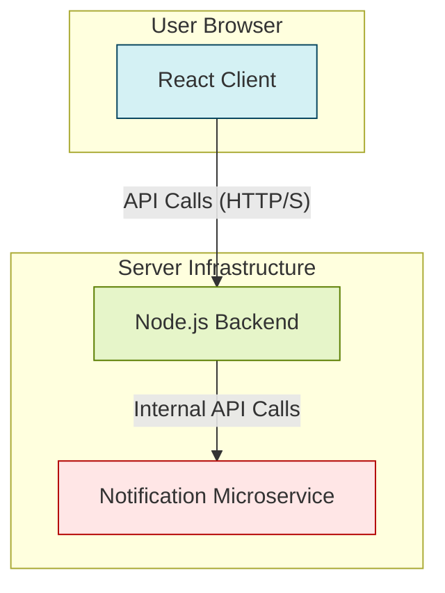
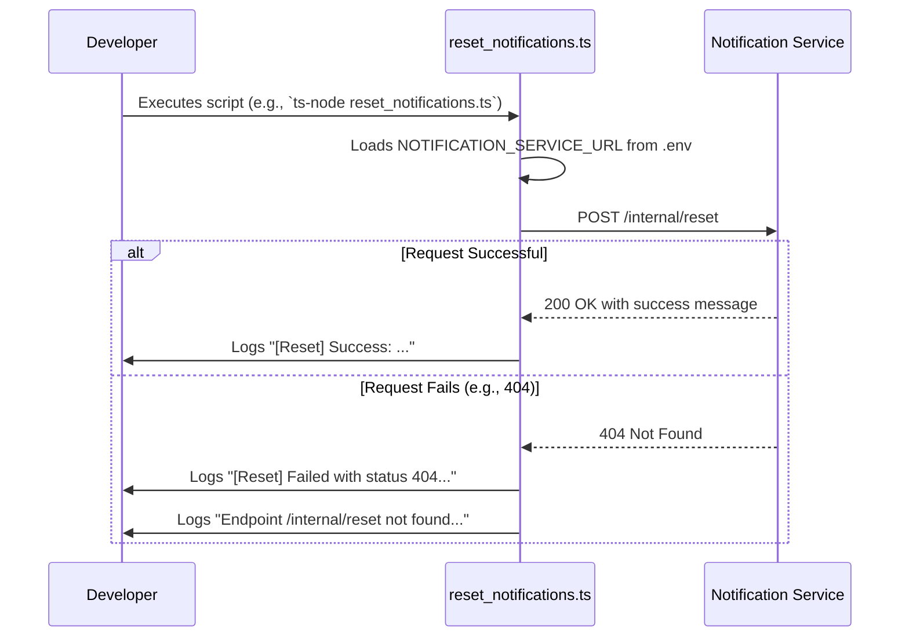

# SynapStore


### SynapStore Technical Documentation

This document provides a comprehensive technical overview of the SynapStore application, covering its architecture, key components, and core workflows. It is intended for developers working on the system.

---

### 1. System Architecture Overview

SynapStore is a full-stack application composed of a React-based client, a Node.js backend, and an external notification microservice. This architecture separates concerns, allowing for independent development and scaling of the user interface and server-side logic.

*   **Client (`SynapStore/client`)**: A modern React single-page application responsible for all user interface rendering and client-side state management. It features a rich library of custom UI components for data visualization and interactive user experiences.
*   **Backend (`SynapStore/backend`)**: A Node.js server, likely using the Express framework, that handles business logic, data processing, and API endpoints. It serves as the primary interface between the client and server-side resources.
*   **Notification Service**: An external microservice responsible for handling user notifications. The backend communicates with this service via HTTP requests to manage tasks like sending alerts or clearing notification data.

The following diagram illustrates the high-level interaction between these core parts of the system.



---

### 2. Backend System

The backend is the authoritative core of the SynapStore application, managing server-side operations and integrations.

#### 2.1. Server Initialization (`index.ts`)

The primary entry point for the backend application is `SynapStore/backend/index.ts`. This file is responsible for bootstrapping and launching the HTTP server.

**Key Responsibilities:**
*   Imports the main application instance (presumably an Express app) from `./app`.
*   Reads the `PORT` from environment variables, defaulting to `3000`.
*   Instantiates and starts the `http.Server`.

**Code Snippet:**
```typescript
// File: SynapStore/backend/index.ts

import app from "./app";
import { Server } from "http";

const PORT = Number(process.env.PORT) || 3000;

let server: Server;

// The server is likely started with a function call like:
server = app.listen(PORT, () => {
  console.log(`Server running on port ${PORT}`);
});
```

This setup is standard for Node.js applications, providing a clean separation between the server configuration (`index.ts`) and the application's routes and middleware (`app.ts`).

#### 2.2. Maintenance Scripts (`reset_notifications.ts`)

The system includes utility scripts for administrative and maintenance tasks. The `reset_notifications.ts` script provides a mechanism to clear all data from the external notification service.

**Purpose:**
This script is intended for development or staging environments to reset the notification state. It sends a `POST` request to a dedicated internal endpoint on the notification service.

**Execution Flow:**
The script's operation follows a clear sequence:
1.  Load environment variables using `dotenv`, specifically `NOTIFICATION_SERVICE_URL`.
2.  Construct the target URL: `${NOTIFICATION_SERVICE_URL}/internal/reset`.
3.  Send an empty `POST` request to the endpoint using `axios`.
4.  Log the success or failure response to the console.



**Implementation Details & Troubleshooting:**
*   **Endpoint Requirement:** The script assumes the notification service exposes a `POST /internal/reset` endpoint. If this endpoint does not exist, the script will fail with a 404 error. The error handling explicitly guides the developer to implement this endpoint.
*   **Security:** The code includes a commented-out header, `"x-admin-secret"`, suggesting a security best practice. For production environments, such an endpoint should be protected by a secret key or other authentication mechanism to prevent unauthorized access.

**Usage Example:**
```bash
# Ensure .env file in the backend directory contains:
# NOTIFICATION_SERVICE_URL=https://your-notification-service.com
# ADMIN_SECRET=your-super-secret-key

# Run the script
npx ts-node SynapStore/backend/scripts/reset_notifications.ts
```

---

### 3. Frontend System

The client is built with React and features a modular structure with a clear separation between layout and UI components.

#### 3.1. Core Layout (`Sidebar.tsx`)

The `Sidebar.tsx` component is a fundamental part of the application's user interface, providing consistent navigation across different dashboard pages.

**Functionality:**
*   Renders a vertical list of navigation links.
*   Uses icons from `lucide-react` for visual clarity.
*   Leverages `react-router-dom`'s `useLocation` hook to dynamically highlight the currently active link.

The `isActive` function is central to its logic:
```typescript
// File: SynapStore/client/src/components/layout/Sidebar.tsx

const location = useLocation();
const isActive = (path: string) => location.pathname === path;

// Usage within the component's render method:
// <Link to={link.path} className={isActive(link.path) ? 'active-class' : ''}>
//   ...
// </Link>
```

This component is designed to be integrated into a main layout container that wraps the page content, ensuring it persists as the user navigates through the application.

#### 3.2. Advanced UI Components

The application contains a rich set of custom UI components located in `SynapStore/client/src/components/ui`. These components encapsulate complex behavior and styling, promoting reusability and a consistent design language.

##### 3.2.1. Sticky Scroll Reveal (`sticky-scroll-reveal.tsx`)

The `StickyScroll` component creates a sophisticated visual effect where a column of text content remains "sticky" while corresponding visual elements (images, videos, or other React components) transition into view as the user scrolls.

**Core Logic:**
It utilizes the `motion/react` (Framer Motion) library to track scroll progress and trigger state changes.

1.  **Scroll Tracking:** `useScroll` is attached to a container element (`ref`). It monitors the scroll position within that container and outputs a `scrollYProgress` value (from 0 to 1).
2.  **State Update:** `useMotionValueEvent` listens for changes to `scrollYProgress`. On each change, it calculates which "card" or content block should be active.
3.  **Breakpoint Calculation:** It determines the active card by comparing the current scroll progress (`latest`) to a series of calculated breakpoints. Each breakpoint represents the scroll position where a new card should become active.

```typescript
// File: SynapStore/client/src/components/ui/sticky-scroll-reveal.tsx

const cardLength = content.length;

useMotionValueEvent(scrollYProgress, "change", (latest) => {
    // Creates an array of progress points, e.g., [0, 0.25, 0.5, 0.75] for 4 cards
    const cardsBreakpoints = content.map((_, index) => index / cardLength);

    // Finds the breakpoint closest to the current scroll progress
    const closestBreakpointIndex = cardsBreakpoints.reduce(
        (acc, breakpoint, index) => {
            const distance = Math.abs(latest - breakpoint);
            if (distance < Math.abs(latest - cardsBreakpoints[acc])) {
                return index;
            }
            return acc;
        },
        0
    );
    setActiveCard(closestBreakpointIndex);
});
```

**Usage:**
The component expects a `content` prop, which is an array of objects, each containing a `title`, `description`, and an optional `content` element (e.g., an image or custom component).

```tsx
import { StickyScroll } from "@/components/ui/sticky-scroll-reveal";

const content = [
  {
    title: "Feature One",
    description: "Description for the first amazing feature.",
    content: ,
  },
  {
    title: "Feature Two",
    description: "Details about the second powerful feature.",
    content: <video src="/feature2.mp4" autoPlay muted loop />,
  },
];

const MyPage = () => {
  return <StickyScroll content={content} />;
};
```

##### 3.2.2. Custom Chart Tooltip (`line-chart.tsx`, etc.)

The files `line-chart.tsx`, `line-charts-1.tsx`, and `line-charts-9.tsx` define a highly customizable tooltip component for data charts, likely built with a library like Recharts. The logic across these files is identical, suggesting a standardized pattern for chart tooltips in the application.

**Purpose:**
This component replaces the default tooltip in a chart, providing fine-grained control over its appearance, formatting, and content. It is designed to be passed to a chart's `Tooltip` component via its `content` prop.

**Data Flow and Rendering:**
The tooltip's rendering is driven by props passed to it by the parent charting library when the user hovers over a data point.


**Key Features:**
*   **Dynamic Label:** The `tooltipLabel` is memoized with `React.useMemo` for performance. It intelligently derives the label from various potential keys (`labelKey`, `dataKey`, `name`) or a provided `label` string.
*   **Configuration Context:** It uses a custom `useChart()` hook to access a shared `config` object. This allows chart-wide settings (like labels or colors) to be defined in one place and consumed by the tooltip.
*   **Custom Formatting:** A `labelFormatter` function can be passed to provide completely custom rendering logic for the label.
*   **Styling:** It uses the `cn` utility from `@/lib/utils` for conditional class name merging, allowing for easy style overrides via the `className` prop.

**Conceptual Usage with Recharts:**
```tsx
import { LineChart, Line, XAxis, YAxis, Tooltip } from 'recharts';
import { ChartTooltip } from '@/components/ui/line-chart'; // Assuming the component is exported as ChartTooltip

const data = [
  { name: 'Jan', desktop: 400, mobile: 240 },
  { name: 'Feb', desktop: 300, mobile: 139 },
  // ... more data
];

const MyLineChart = () => (
  <LineChart width={500} height={300} data={data}>
    <XAxis dataKey="name" />
    <YAxis />
    {/* The custom tooltip is passed to the content prop */}
    <Tooltip
      content={<ChartTooltip indicator="dot" />}
      cursor={false}
    />
    <Line type="monotone" dataKey="desktop" stroke="#8884d8" />
    <Line type="monotone" dataKey="mobile" stroke="#82ca9d" />
  </LineChart>
);
```
This integration allows the `ChartTooltip` to receive the necessary `payload` from Recharts whenever the user interacts with the chart, enabling it to render rich, context-aware information.
